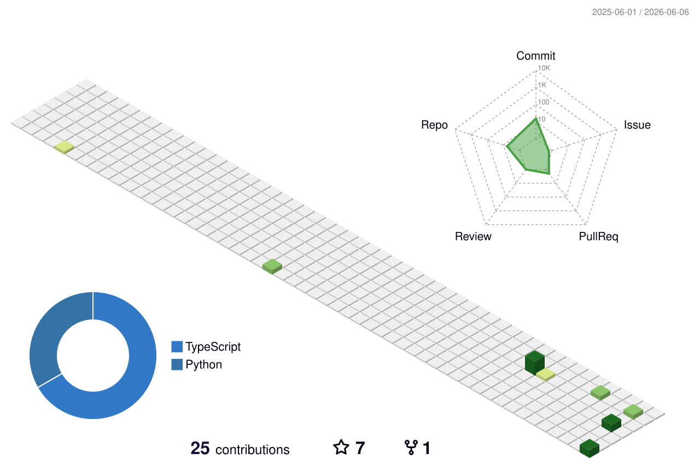

  

  <a href="https://git.io/typing-svg">
    _UPLOADING_USER_CONSCIOUSNESS...;>_ROLE:+FULLSTACK_ENGINEER+%26+SYSTEM_ARCHITECT;>_EXPERTISE:+PYTHON,+TYPESCRIPT,+POO;>_CONNECTION_ESTABLISHED." alt="Typing Terminal" />
  </a>

---

<table style="width: 100%; border-collapse: collapse; border: none;">
  <tr>
    <td style="width: 50%; vertical-align: top; border: 1px solid #00FF00; padding: 15px; background-color: #0d1117;">
      <h3 align="center" style="color: #00FF00;">🗃️ [CLASSIFIED_DATA] :: SUBJECT_PROFILE</h3>
      <code>
      > IDENTITY: Gustavo Dutra Luiz Barbosa 
      > ALIAS: gustavobarbosa-dev 
      > BASE_OF_OPERATIONS: Rio Grande do Sul, Brazil 
      > COMMS_LINK: <a href="mailto:gustavobarbosa.net@gmail.com" style="color: #00FF00;">gustavobarbosa.net@gmail.com</a> 
      > PRIMARY_DIRECTIVE: Transformar lógica complexa em sistemas robustos e eficientes. 
      > SPECIALIZATIONS: Object-Oriented Programming (POO), Data Analysis, Game Logic. 
      > SYSTEM_STATUS: ONLINE & CODING.
      </code>
    </td>
    <td style="width: 50%; vertical-align: top; border: 1px solid #00FF00; padding: 15px; background-color: #0d1117;">
      <h3 align="center" style="color: #00FF00;">⚙️ CYBERWARE [INSTALLED_SKILLS]</h3>
      

         
        
      

    </td>
  </tr>
</table>

</table>

---

<h2 align="center"> 📂 ACTIVE_OPERATIONS [RECENT_PROJECTS] </h2>

---

  
<b style="color: #00FF00; font-size: 18px; cursor: pointer;">>_ EXPANDIR_DIAGNÓSTICO_DE_SISTEMA (ESTATÍSTICAS)</b>

   
  

    
  

 

---

<h2 align="center"> 🌌 HOLOGRAPHIC CONTRIBUTION MATRIX </h2>

  

  

  <picture>
    <source media="(prefers-color-scheme: dark)" srcset="dist/github-snake-dark.svg">
    <source media="(prefers-color-scheme: light)" srcset="dist/github-snake-dark.svg">
    
  </picture>

